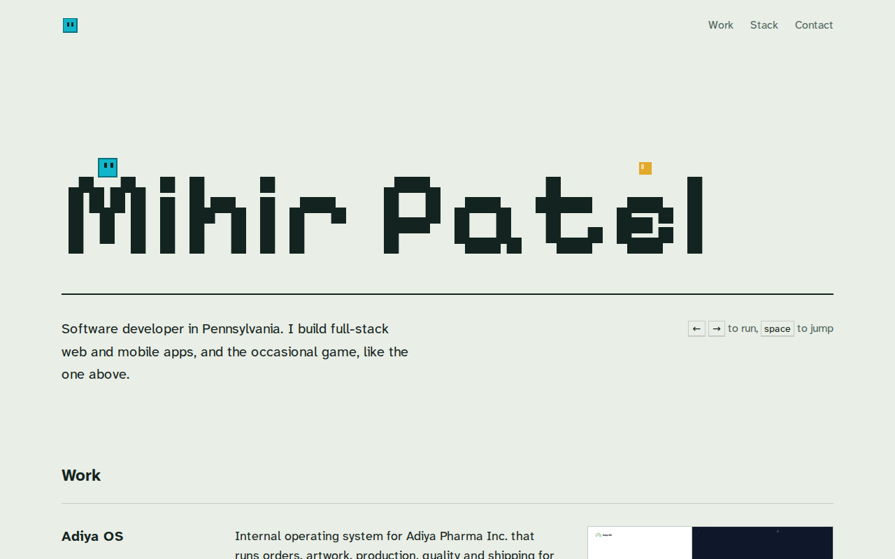

# hellomihir.com

My personal site, live at [hellomihir.com](https://hellomihir.com).

<picture>
  <source media="(prefers-color-scheme: dark)" srcset="docs/screenshot-dark.png">
  
</picture>

The name at the top of the page is a tiny platformer. Run with ← → or A D, jump with space, ↑ or W, and press ↓ or S to drop through a letter. On a phone, tap where you want to jump. The letters are one-way platforms, and the player is the cyan square from my game [Jump](https://mihir9702.github.io/jump/).

The Work section covers Adiya OS (private), [Aura](https://github.com/Mihir9702/Aura) and [Jump](https://github.com/Mihir9702/jump).

Built with Next.js 16 (App Router), React 19, Tailwind CSS 4 and TypeScript.

## Run it locally

```sh
npm install
npm run dev
```

Then open http://localhost:3000.

## Editing content

Everything the site says lives in `src/content/`:

- `site.ts`: name, role, location, social links, and an optional email for the contact line
- `projects.ts`: the work list (screenshots go in `src/assets/`)
- `skills.ts`: the stack list

The resume linked from the header and the contact line is `public/resume.pdf`.

The game is `src/components/Playfield.tsx`, and the palette is at the top of `src/app/globals.css`.

## Deploying

The site deploys on Vercel from `main`. The domain, hellomihir.com, is registered with Cloudflare, which also hosts its DNS. Two records point it at Vercel:

| Type  | Name  | Content                                | Proxy status |
| ----- | ----- | -------------------------------------- | ------------ |
| A     | `@`   | the IP Vercel shows for hellomihir.com | DNS only     |
| CNAME | `www` | the target Vercel shows for www        | DNS only     |

Keep both records on DNS only (grey cloud). Vercel issues the certificates, and Cloudflare's proxy gets in the way of that. In Vercel, hellomihir.com is the primary domain and www redirects to it.

Metadata, the canonical link, the sitemap, robots.txt and the social preview image all use `url` from `src/content/site.ts`, so changing domains is a one-line edit.

Fonts: Pixelify Sans and Atkinson Hyperlegible Next, both under the SIL Open Font License (copies in `src/assets/fonts/`).
